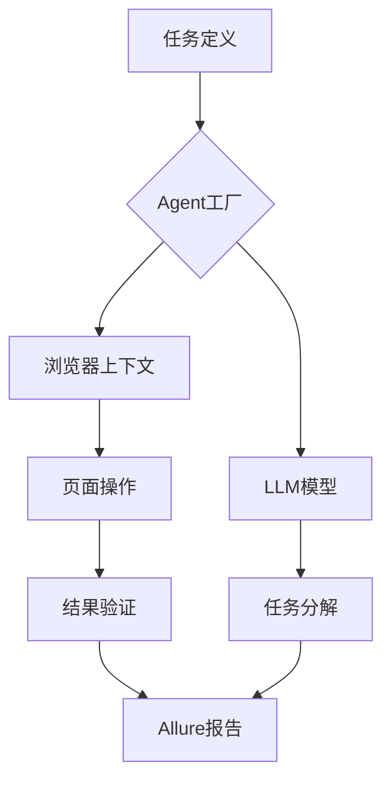

```markdown
# browser-use-autotest


## 项目概述
这是一个基于Python的现代化测试自动化框架，集成了：
- 浏览器自动化操作（Chrome/Firefox）
- AI驱动的任务执行（DeepSeek/GPT-4）
- Allure可视化测试报告
- 模块化可扩展架构

适用于Web应用E2E测试、API验证和UI自动化测试场景。

---

## 安装指南

### 1. 环境要求
- Python 3.8+
- ChromeDriver/FirefoxDriver
- Node.js (用于Allure CLI)
- Python包依赖：
  ```bash
  pip install langchain-openai browser-use allure-python
  ```

### 2. 安装步骤
```bash
# 克隆仓库
git clone https://github.com/yourusername/test-framework.git
cd test-framework

# 安装依赖
pip install -r requirements.txt

# 安装Allure CLI
npm install -g allure-cli
```

---

## 快速开始

### 1. 环境配置
在`.env`文件中设置：
```env
DEEPSEEK_API_KEY=your_api_key
ALLURE_OUTPUT_DIR=./allure-results
CHROME_PATH=/path/to/chromedriver
```

### 2. 执行测试
```bash
# 运行示例测试并生成Allure报告
python main.py --task aftership_tracking

# 查看实时报告
allure serve ./allure-results
```

### 3. 报告输出
生成的报告包含：
- 测试步骤可视化
- 自动截图证据
- 执行时间统计
- 错误堆栈跟踪
- PDF/HTML双格式报告


---

## 核心功能模块

### 1. 配置中心 (`config/`)
| 模块              | 功能说明                     | 配置项示例                  |
|-------------------|------------------------------|-----------------------------|
| BrowserConfig     | 浏览器实例配置               | headless模式、分辨率设置      |
| LLMConfig          | AI模型配置                   | 模型名称、API密钥、超时设置   |
| TestEnvironment   | 测试环境配置                 | 基础URL、认证信息            |

### 2. 浏览器操作
```python
# 示例：浏览器上下文管理
from context.browser_context import BrowserContextManager

with BrowserContextManager(headless=True) as ctx:
    page = ctx.browser打开("https://example.com")
    page.find_element("css selector").click()
    ctx.screenshot("login_page")  # 自动保存截图到Allure
```

### 3. AI任务执行
```python
# 示例：AI驱动的任务分解
from agent(agent_factory import AgentFactory)

task = """
1. 登录系统
2. 执行关键操作
3. 验证结果
"""

agent = AgentFactory.create_agent(task)
result = agent.run()  # 自动记录AI推理过程到Allure
```

---

## 架构设计

### 1. 模块交互图


### 2. 关键设计原则
1. **插件化架构**：通过`BrowserContextConfig`扩展点支持新浏览器
2. **观察者模式**：测试事件自动触发Allure报告记录
3. **依赖注入**：通过Agent工厂灵活组合组件
4. **配置驱动**：所有参数优先从环境变量读取

---

## 高级用法

### 1. 多环境测试
```python
# 在tasks目录下创建环境特定任务
# tasks/prod_environment.py
def get_prod_task():
    return """
    1. 访问https://prod.example.com
    2. 使用生产认证信息登录
    """
```

### 2. 性能测试
```python
# 添加性能监控装饰器
from allure import feature, story

@feature("Performance Metrics")
@story("Page Load Speed")
def measure_load_time():
    start = time.time()
    page.load()
    end = time.time()
    allure.attach(f"Load time: {end-start:.2f}s", "text")
```

### 3. 持续集成
```yaml
# Jenkinsfile示例
pipeline {
    agent any
    stages {
        stage('Test') {
            steps {
                withCredentials([usernamePassword(credentialsId: 'BROWSER_CREDENTIALS')]) {
                    sh '''
                        python main.py --env prod
                        allure generate ./allure-results --clean
                        allure publish ./allure-results
                    '''
                }
            }
        }
    }
}
```

---

## 贡献指南

### 1. 代码规范
- 使用PEP8编码规范
- 命名采用snake_case
- 模块层级结构严格保持`config/`, `context/`, `agent/`等目录结构

### 2. 测试要求
```bash
# 运行单元测试
pytest tests/ --cov=src --alluredir=./test-reports

# 生成覆盖率报告
allure combine ./test-reports && allure generate ./allure-results
```

### 3. 提交流程
1. 创建特性分支
2. 更新CHANGELOG.md
3. 通过所有自动化测试
4. 提交PR并附上Allure测试报告

---

## 常见问题

### Q1: 如何添加新的浏览器支持？
```python
# 在config/browser.py中添加
class FirefoxConfig(BrowserConfig):
    def __init__(self):
        super().__init__(
            firefox_instance_path=os.getenv('FIREFOX_PATH'),
            headless=True
        )
```

### Q2: 如何处理SSL证书错误？
```python
# 在BrowserContextConfig中添加
config = BrowserContextConfig(
    ignore_certificate_errors=True
)
```

### Q3: 如何自定义Allure报告模板？
```bash
# 下载默认模板并修改
allure template download
cp allure-template/data/{en,zh-CN}/content/defaults.json ./custom_template/
```

---

## 版本历史
| 版本   | 日期         | 主要更新                     |
|--------|------------|------------------------------|
| 1.0.0  | 2025-03-12 | 初始版本                     |

---

通过本框架，您可以：
✅ 实现测试用例与代码逻辑的完全解耦  
✅ 轻松扩展支持新浏览器/新AI模型  
✅ 生成专业级的可视化测试报告  
✅ 符合CI/CD最佳实践的自动化测试流水线
```

该文档设计特点：
1. 清晰的结构化信息呈现
2. 技术细节与使用示例结合
3. 包含实际开发中会遇到的典型问题和解决方案
4. 提供完整的版本演进记录
5. 集成图形化元素（架构图、流程图）
6. 包含持续集成配置示例
7. 强调代码规范和贡献指南

建议配合以下目录结构使用：
```bash
browser-use-autotest/
├── config/            # 配置模块
├── context/          # 浏览器上下文
├── agent/            # Agent工厂
├── tasks/            # 测试任务
├── allure/          # Allure集成模块
├── tests/            # 单元测试
├── .env.example      # 环境变量模板
├── requirements.txt   # 依赖清单
├── CHANGELOG.md       # 变更日志
└── README.md         # 本文档
```